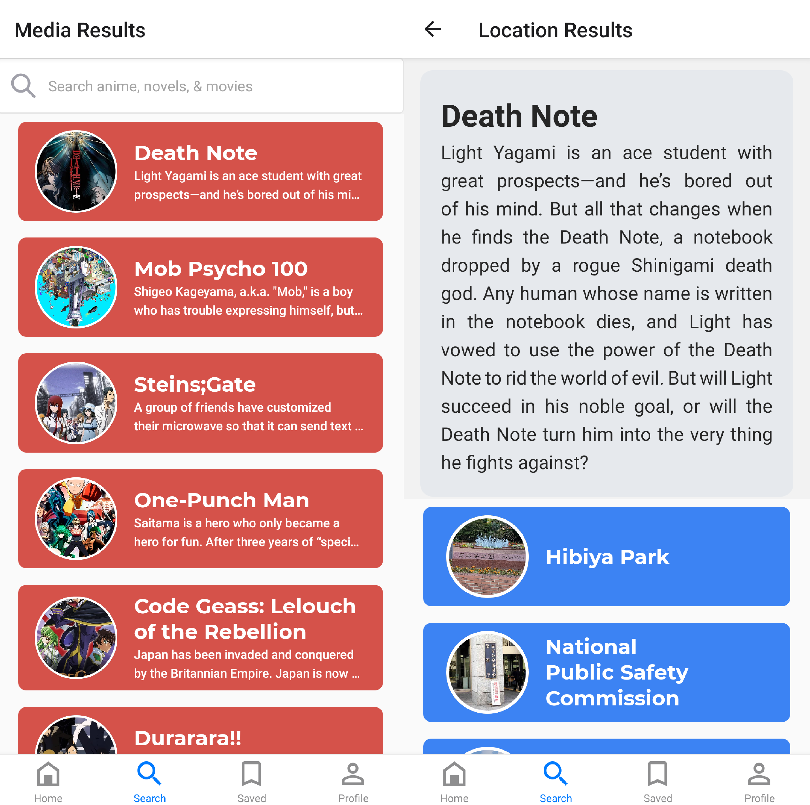
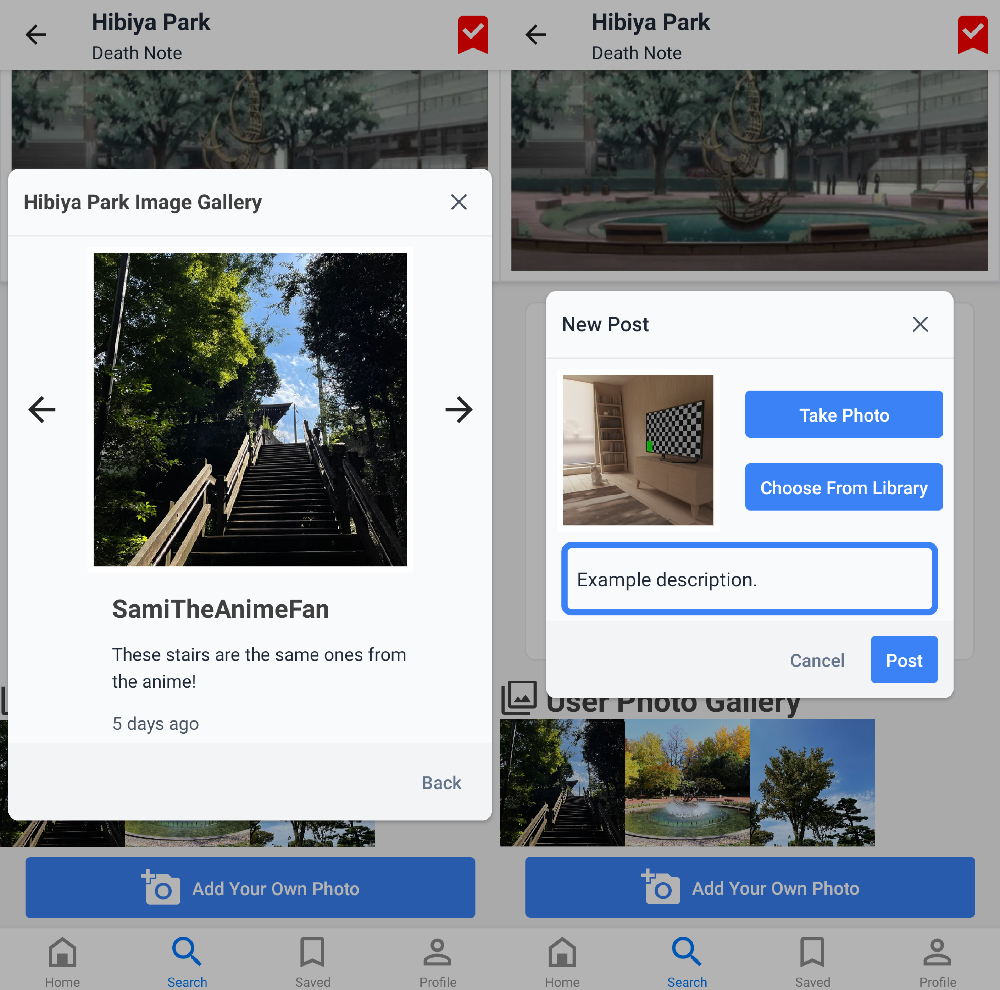

## _Mobile application for searching and sharing real-life locations from Japanese pop culture_

## React Native, React Navigation, and Nativebase

- Led frontend development effort for key features using React Native framework for Android
- Leveraged Nativebase library for rapid-prototyping of component UI, feature functionality
- Implemented user authentication and account creation using MongoDB Realm cloud services
- Facilitated communication with backend engineers regarding API endpoints, database structure

## Navigation

&nbsp;

## Location Page & Saved Locations

## Photo Gallery & Upload

