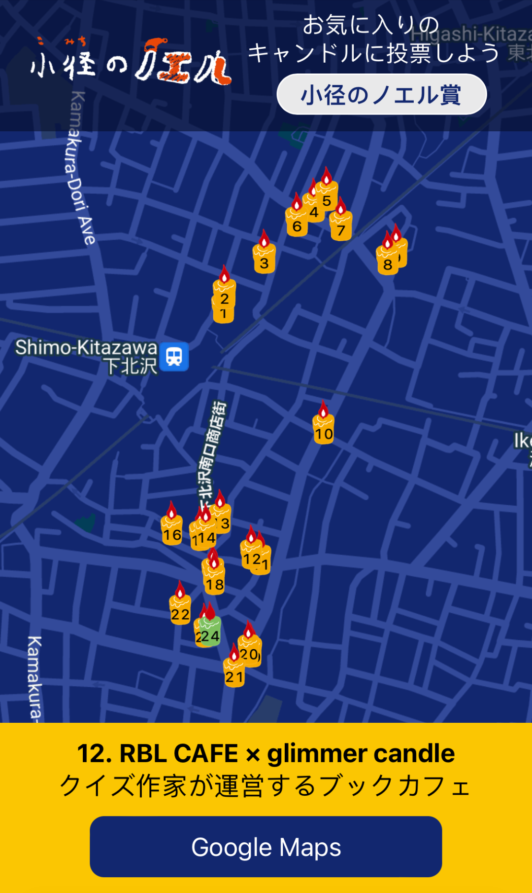

## _Responsive web application guiding users to participating shops for community events_

## Firebase/Firestore, React Google Maps

- Designed feature-rich, full stack SPA in React using modular components, Firebase, Maps API
- Deployed full stack application using Firebase Hosting, continuous deployment using Netlify
- Executed preliminary user testing, relayed results to stakeholders during informal meetings

[Live Deployment](https://komichinonoel.netlify.app/)
